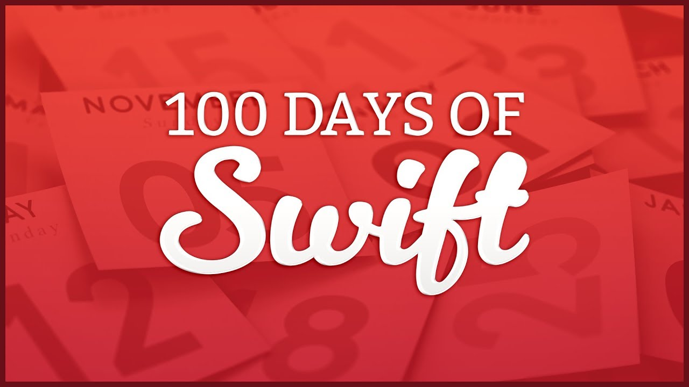

I started Paul Hudson's well-renowned course [100 Days Of Swift](https://www.hackingwithswift.com/100).



## Day 1-5

This is all _mostly_ recap for me since I'm not new to programming but Swift does do a couple things differently. It's actually closer to Python than I had originally realized. Probably the coolest feature I learned was `parameter labels` on Day 5. Swift is a bit more explicit and verbose than other languages and this is an example of where writing _more_ code ends up not being a bad thing.

Before we go on, worth mentioning that parameter labels are optional, and you can have one _or_ two but you *can't* have 3 or more. So in this function we have 2 parameter labels *to* and *name*. The `to` is used externally (ouside of the function) and `name` is used in the function. They're read in left to right order to the leftmost (or first) parameter label is always going to be the external one. The next/second one is the internal. 
```swift
func sayHello(to name: String) {
    print("Hello, \(name)!")
}

sayHello(to: "Taylor")
```
So in the function we shouldn't see `to`, only `name` when writing our variables. Outside the function definition, when we're calling it, we'll use the first parameter label `to` in it. We *won't* use `name` externally. 

We can also omit labels with an underscore ("_") like this. So it's basically just saying we're using this two-parameter label method but there's no need to name the first so when we call the function we'll just pass the string.
```swift
func greet(_ person: String) {
    print("Hello, \(person)!")
}

greet("Taylor")
```

## Day 6 & 7

Closures.