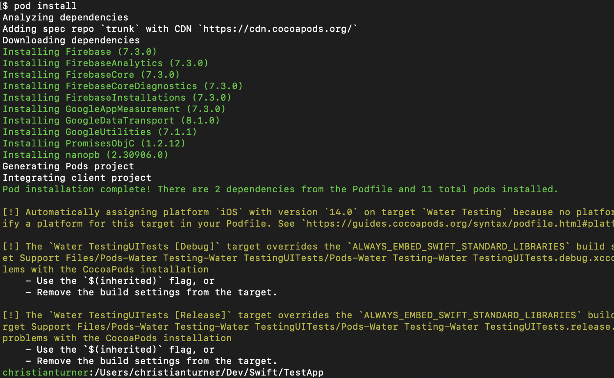

I'm blogging about my process & experience with setting up account creation, login, and authentication using Google's Firebase.


I, again, [asked Reddit](https://www.reddit.com/r/SwiftUI/comments/kl6jel/firebase_sdk_account_creation_question/) about potentially setting this up by myself, from scratch. I wanted to test out provisioning my own database and trying to write an account portal myself just to go through the exercise of it all. However, most everyone suggested against that so here we are.

I'm working off of this [blog post](https://designcode.io/swiftui-handbook-firebase-auth) and after signing up and installing Cocoapods I was ready to add my code.



Since there's no AppDelegate in the new SwiftUI apps I had to add the `Firebase.configure()` in a different way but thankfully I found [this blog post](https://1998design.medium.com/how-to-add-firebase-to-swiftui-2-2020-fbd953e31c83) to help me out. It had me add it like this in the SwiftUI App Protocol.
```swift
    init() {
        FirebaseApp.configure()
    }
```
but then got the error
```swift
ld: in /Users/christianturner/Dev/Swift/TestApp/Pods/FirebaseAnalytics/Frameworks/FIRAnalyticsConnector.framework/FIRAnalyticsConnector(FIRAnalyticsConnector_a8eeba373b74508311b8b22b8d3202a6.o), building for iOS Simulator, but linking in object file built for iOS, file '/Users/christianturner/Dev/Swift/TestApp/Pods/FirebaseAnalytics/Frameworks/FIRAnalyticsConnector.framework/FIRAnalyticsConnector' for architecture arm64
```
but both [this comment](https://stackoverflow.com/a/65460729/9370085) and [this other blog](https://medium.com/@khushwanttanwar/xcode-12-compilation-errors-while-running-with-ios-14-simulators-5731c91326e9) resolved it! I know this is a lot of extra info about how I resolved these little issues, but maybe it'll help out another fellow M1 user who runs into a similar issue.