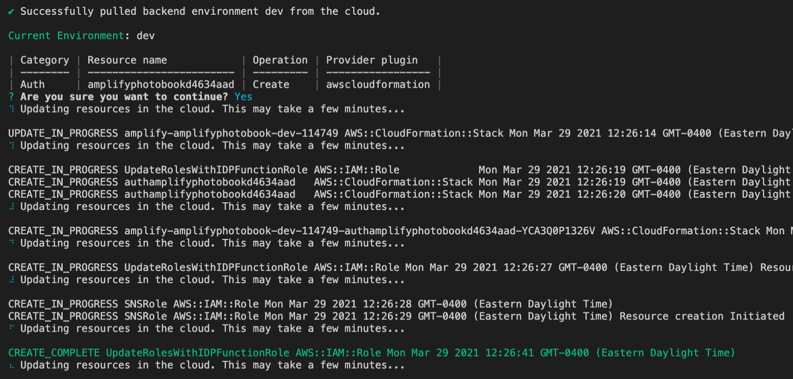
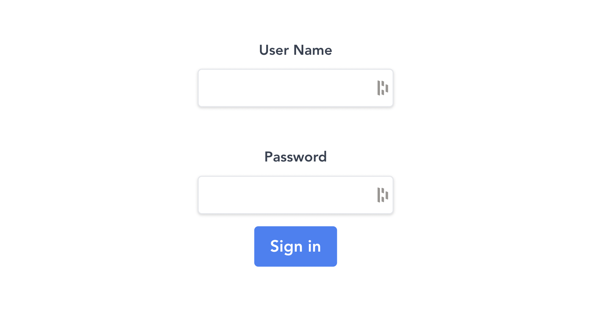

This is my first big Vue project I'm building.

## Project Setup

---

**Repo: [Photobook](https://github.com/christiandavidturner/Photobook) **  
**Website: [photobook.netlify.app](https://photobook.netlify.app/) **  
**Tutorial: ["Full Stack Photobook App | Vue, GraphQL, AWS Amplify"](https://www.youtube.com/watch?v=w0p7ywfHesw) **

#### Project Setup & Config:

- set up Vue project (Vue 3, Vue Router)
- connect to Git
- install AWS Amplify ([Library](https://www.npmjs.com/package/aws-amplify), [CLI](https://www.npmjs.com/package/@aws-amplify/cli), and [UI Components](https://www.npmjs.com/package/@aws-amplify/ui-components)), [Tailwind](https://tailwindcss.com/docs/guides/vue-3-vite), [UUID](https://www.npmjs.com/package/uuid),
- `amplify config` & `amplify init` to connect cloud instance to local working files

#### Add Authentication:

- add authentication ([AWS Cognito](https://aws.amazon.com/cognito/)) with `amplify add auth`
- use `amplify status` to check its been added
- we then use `amplify push` to deploy changes to the cloud

I set up our Vuex actions in our store. Here we're bringing in Auth from AWS Amplify by `import { Auth } from "aws-amplify";` and then [following the docs to implement](https://docs.amplify.aws/lib/auth/emailpassword/q/platform/js). We set up our generic user actions: sing up, sign in, sign out, and sign in confirmation. Next we need to create our Login screen component

#### Login Component:

Our primary login screen is a simple form with two input fields. We're using Tailwind CSS for the styling and we're using a `v-model` directive for two-way data binding in each field. We're also importing [`mapActions`](https://vuex.vuejs.org/guide/actions.html#dispatching-actions-in-components) from Vuex as a helper method to allow us to talk to our Vuex store and write less code in the process. We're then assigning our data object to the user's login data

#### Set Up Routes:

Using [Vue Router's name routes](https://router.vuejs.org/guide/essentials/named-routes.html) we are setting up a couple pages. One is our `/signup` page which is self-explanatory. The next one is an `/album` page and we'll apped an `:id` (i.e. `/album/:id`)to keep the routes dynamic, since each user will have their own unique albums. We're also adding a `meta` property of `{ requiresAuth: true }` which prevents a user from seeing the page unless they're signed in. Last is the `/albums/` page which will showcase all our albums, and we'll add auth to it as well.

#### Create Signup Page:

Now
