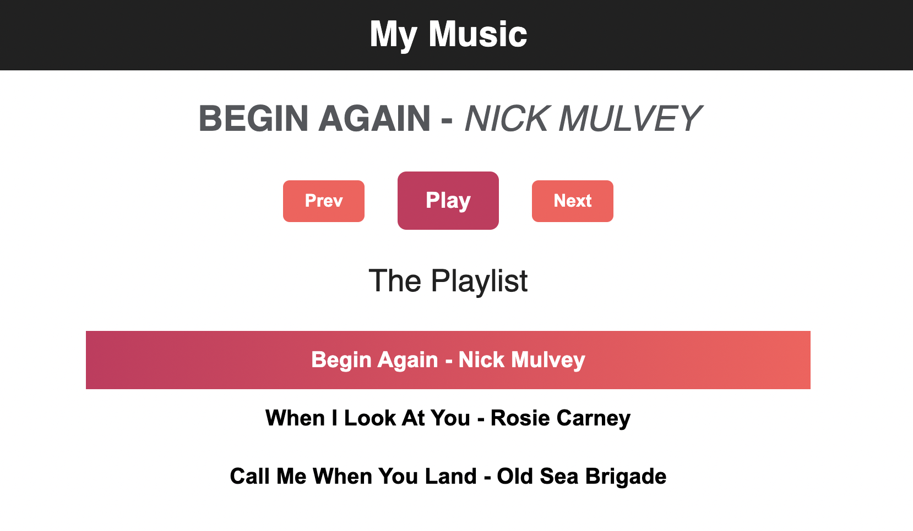
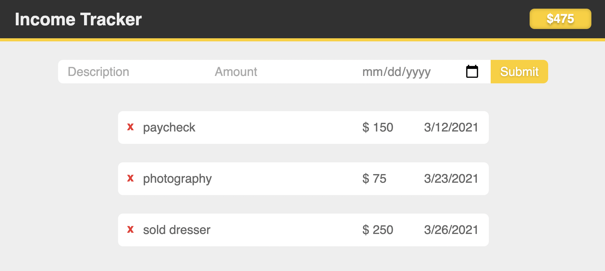

<!-- I'll be learning Vue 3 by [working through the official docs](https://v3.vuejs.org/guide/introduction.html) in order. -->

I'll be learning Vue 3 by [building projects in this YouTube playlist](https://www.youtube.com/watch?v=Ls1WfzOrKkc&list=PLR8vUZDE6IeO_xCvdbfT1rtL4r4jc8ixm&ab_channel=TylerPotts) in order. I give all the info to clone the projects and play with them yourself. I deployed these using Netlify and I linked the tutorials below as well. I added some info, screenshots, anectodes about the project and then I wrapped it up with some bullet points of what I learned from each project. The best way to learn is to build and then "teach." This blog is my way to expound on and explain what I did.

# Movie Lookup

---

**Repo: [Vue-Movies](https://github.com/christiandavidturner/Vue-Movies) ** <br/>
**Website: [movies-vue.netlify.app](https://movies-vue.netlify.app/) ** <br/>
**Tutorial: ["Build a Movie App With Vue JS - A Vue 3 Beginners tutorial"](https://www.youtube.com/watch?v=UHewcsv6uJY&list=PLR8vUZDE6IeO_xCvdbfT1rtL4r4jc8ixm&index=7) **

This project uses the [Open Movie Database API](https://www.omdbapi.com/) to look up movie & show data like you would on IMDB. There's a home, results, and movie detail screen. I've worked with React Router before, and Vue Router wasn't too difficult to pick up. This was my favorite project of the three.

[](https://movies-vue.netlify.app/)

I really enjoyed how straight forward the fetch requests are using [ES6 arrow functions](https://www.sitepoint.com/es6-arrow-functions-new-fat-concise-syntax-javascript/).

```javascript
const SearchMovies = () => {
  if (search.value != "") {
    fetch(`https://www.omdbapi.com/?apikey=${env.apikey}&s=${search.value}`)
      .then(response => response.json())
      .then(data => {
        movies.value = data.Search
        search.value = ""
      })
  }
}
```

#### Things I learned:

- API fetching with string interpolation
- forms in Vue
- Vue Router
- the `beforeMount` [lifecycle method](https://v3.vuejs.org/api/options-lifecycle-hooks.html#beforemount)
- Sass styling
- [template refs](https://v3.vuejs.org/guide/composition-api-template-refs.html)

<br/><br/>

# Music Player

---

**Repo: [Vue-Music-Player](https://github.com/christiandavidturner/Vue-Music-Player) ** <br/>
**Website: [music-player-vue.netlify.app](https://music-player-vue.netlify.app/) ** <br/>
**Tutorial: ["Build a Music app using VueJS | Tutorial for Beginners"](https://www.youtube.com/watch?v=BPyniDJ5QOQ&list=PLR8vUZDE6IeO_xCvdbfT1rtL4r4jc8ixm&index=3) **

This project uses the Javascript [Audio() API](https://developer.mozilla.org/en-US/docs/Web/API/HTMLAudioElement/Audio) to play the local songs we have in our directory. We can cycle through songs as well as play and pause the song.

[](https://music-player-vue.netlify.app/)

I like the way Vue does the `v-if` & `v-else` properties to conditionally render one of the two buttons depending on the play state.

```html
<div class="controls">
  <button class="prev" @click="prev">Prev</button>
  <button class="play" v-if="!isPlaying" @click="play">Play</button>
  <button class="pause" v-else @click="pause">Pause</button>
  <button class="next" @click="next">Next</button>
</div>
```

#### Things I learned:

- the [Audio() API](https://developer.mozilla.org/en-US/docs/Web/API/HTMLAudioElement/Audio)
- working with mp3s
- conditional CSS classes
- creating custom methods

<br/><br/>

# Income Tracker

---

**Repo: [Vue-Income-Tracker](https://github.com/christiandavidturner/Vue-Income-Tracker) ** <br/>
**Website: [vue-income-tracker.netlify.app](https://vue-income-tracker.netlify.app/) ** <br/>
**Tutorial: ["Build an Income Tracker in Vue JS ~ Composition API"](https://www.youtube.com/watch?v=AjV7k7t78Ik&list=PLR8vUZDE6IeO_xCvdbfT1rtL4r4jc8ixm&index=2&ab_channel=TylerPotts) **

This project allows us to add income we receive by adding a description, a dollar value (amount), and a date that we received the payment. Currently, I have not added the deleting income functionality.

[](https://vue-income-tracker.netlify.app/)

These snippets aren't the full components, but this just outlines the `emit` functionality of the [Composition API](https://www.vuemastery.com/blog/vue-3-data-down-events-up/).

### App.vue

```javascript
  // A) emit allows us to pass events back up to parent
  setup(props, { emit }) {
    const formData = reactive({
      desc: null,
      value: null,
      date: null,
    });

    function FormHandler() {
      // B) the second parameter, the object, is what we'll pass back up to our App component
      emit("add-income", {
        desc: formData.desc,
        value: formData.value,
        date: formData.date,
      });

      formData.desc = null;
      formData.value = null;
      formData.date = null;
    }
```

### Form.vue

```javascript
// C) when we call this function it will take those props as params
<Form @add-income="AddIncome" />

// D) which we're passing in as "data"
//  this data is what's being passed back up from our Form component
function AddIncome(data) {
    console.log(data);
```

#### Things I learned:

- the Composition API (emit)
  - using `emit` to pass events back up to parent
- date formatting
- nested components syntax in Vue
