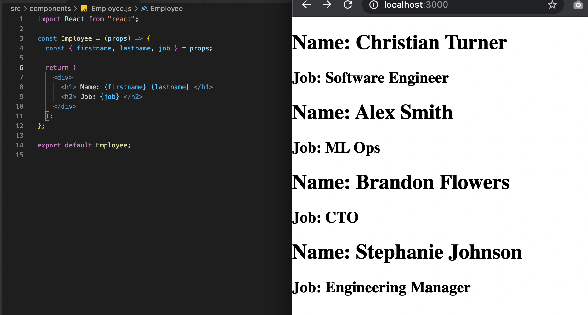

### Props
Our `App` component is the parent to `Employee` and we have several ways to pass our props from parent to child. First, we'll just pass `props` in our arrow function and explicitly name each prop like `props.first`, `props.job` etc.

```javascript
import Employee from "./components/Employee";
function App() {
  return (
    <div>
      <Employee first={"Christian"} last={"Turner"} job={"SWE"} />
      <Employee first={"Alexa"} last={"Smith"} job={"ML Ops"} />
      <Employee first={"Brandon"} last={"Flowers"} job={"CTO"} />
      <Employee first={"Stephanie"} last={"Johnson"} job={"Manager"} />
    </div>
  );
}
```
```javascript
const Employee = (props) => {
  return (
    <div>
      <h1> Name: {props.first} {props.last} </h1>
      <h2> Job: {props.job} </h2>
    </div>
  );
};
```


Or we can use an [ES6 method called "Destructuring"](https://hacks.mozilla.org/2015/05/es6-in-depth-destructuring/) to assign all our prop types to our props variable and therefore be able to drop the `props.____` everywhere in our JSX. This is done on one line and makes our code a lot more readable. 
```javascript
const Employee = (props) => {
  const { firstname, lastname, age, job } = props;
  return (
    <div>
      <h1> Name: {firstname} {lastname} </h1>
      <h2> Job: {job} </h2>
    </div>
  );
};
```

Another quick not, we can use another [ES6 method called "Named Parameters"](https://exploringjs.com/impatient-js/ch_callables.html#named-parameters) to assign alias's to any/all props by adding a colon after it and then the alias we want to use. We'll then pass the alias down below in the JSX. This is useful, for instance, if we're passing in a of nested props and we have two `id` props or `name` props. As in, say we have a department `name` and and employee `name` parameter, now this is a bad naming convention, but I'm just trying to explain why aliasing could come in handy. We can alias them as `{name: deptName, name: employeeName}` for instance.

```javascript
const Employee = (props) => {
    const { firstname: first, lastname: last, job: myJob } = props;
    return (
        <div>
        <h1> Name: {first} {last} </h1>
        <h2> Job: {myJob} </h2>
        </div>
    );
};
```


### useState
This is the first React hook we're going over. You'll see inside our component we immediately have [array destructuring](https://www.freecodecamp.org/news/array-destructuring-in-es6-30e398f21d10/). This is common practice with hooks. We have two variable set our initial state. The first variable is going to be our `state` variable and the second is the updapter function. It's common practice to name the updater function a `use` + first state variable name to be explicit with what's going on. For instance: `[count, setCount]`, `[age, setAge]`, `[name, setName]` etc etc. Then, on the right side, we have our actual `useState()` function. Within the parentheses we put in our __**initial state**__. So for `setCount` in our `Counter` component, it'd be wise to set it to 0 at the start. However, if we were using an input form, we'd pass in an empty string like this `useState('')`. We need the field to be empty in preparation for the user to add in what they want to.

In the buttons, you'll see we have an empty arrow function that calls `setCount` and mutates state.

```javascript
export default function Counter() {
  const [count, setCount] = useState(0);
  return (
    <div>
      <h3>The count is: {count}</h3>
      <button onClick={() => setCount(count + 1)}>Increment</button>
      <button onClick={() => setCount(count - 1)}>Decrement</button>
    </div>
  );
}
```


<!-- ### Array Destructuring -->
